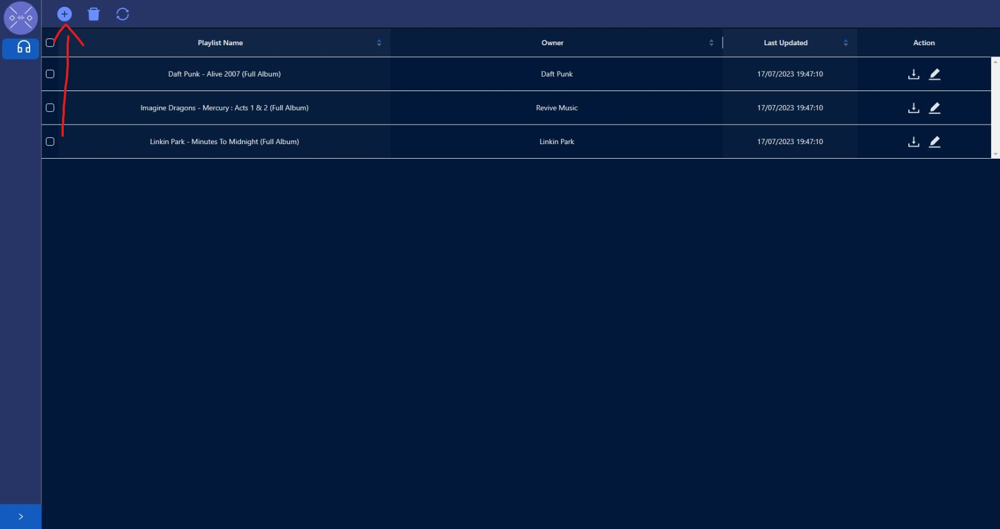
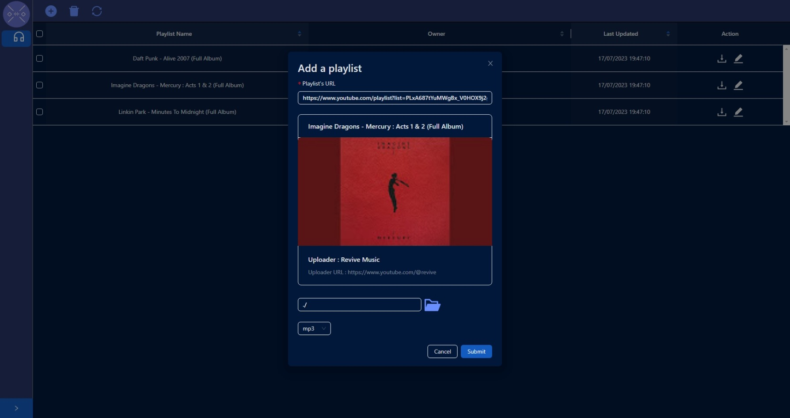
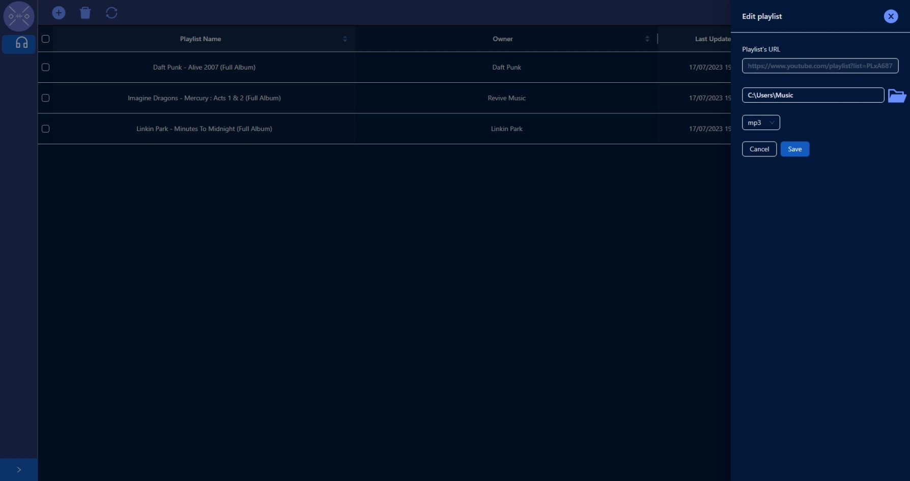
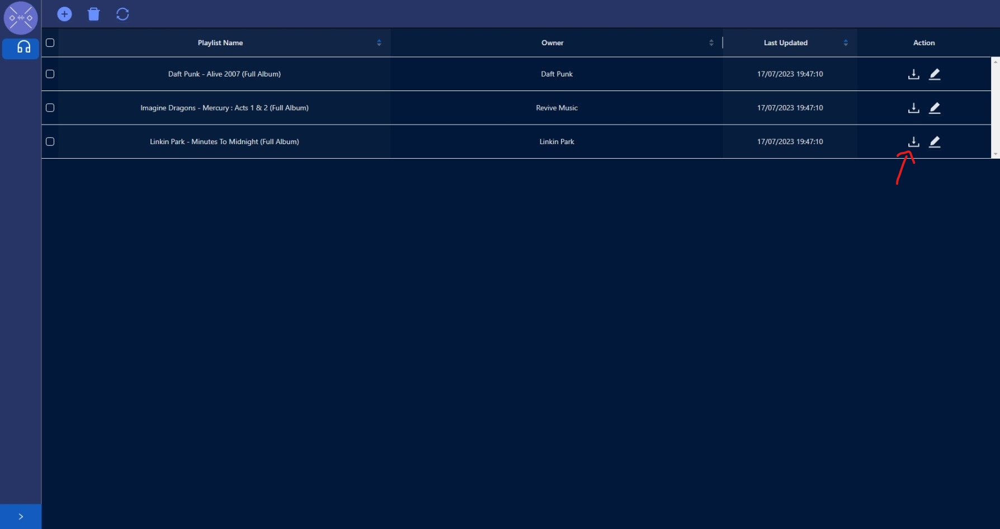

# RMusicDL

A desktop application that allows you to save your favorite playlists online and download all the content they contain. You can even choose in which audio format you want your music and where to download it. In addition, the content of the playlists will be updated and existing content will not be re-downloaded.

## How it works
This is the main screen where you can view and manage your saved playlists.

By clicking on the plus icon at the top left, you can add a playlist.

After clicking on the plus icon, a dialog window will open. Here you can copy and paste the URL of the playlist and the software will try to collect the information about it.

Once the playlist information has been obtained, you will see this information and be able to choose where to download the content and in what format. Click submit to confirm and add the playlist to the main screen.

By clicking on a playlist in the grid, you will see a sidebar on the right which allows you to change the configuration of the playlist, i.e. the download path and the content format.

If you check the box on the left of the screen for at least one playlist, then click the trash icon at the top of the screen. You will delete the playlists for which the box has been checked.

En cliquant sur l'icône à droite de la liste de lecture, vous commencerez à la télécharger. Pendant le téléchargement, l'icône changera et lorsqu'il sera terminé, il reprendra sa forme initiale.

## Purpose
This app was designed to download playlists from Youtube. Nontheless, it can technically download a music only or content of channel on youtube and even from other web site as it uses yt-dlp to download the contents which support a lot of websites (list of all supported websites [here](https://github.com/yt-dlp/yt-dlp/blob/master/supportedsites.md)), but I don't know what will be the behavior with those.

## Issues
If you find any bugs or have any request about an enhancement for the software don't hesitate to add in the Issues tab and I will be glad to try to answer your request.

## Contribution
Any help is appreciated.
